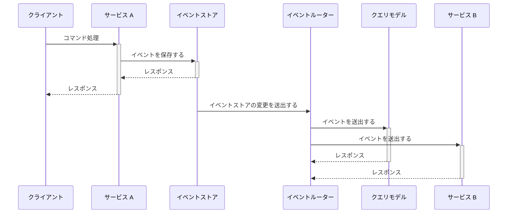

# はじめに

以前書いた [Rust で Event Sourcing を試してみた ~ AWS のブログを参考に模倣する ~](https://zenn.dev/pyama2000/articles/a0f612677b658b) ではイベントストア (イベントを保存するデータベース) に MySQL を利用しました。MySQL 単体では非同期にクエリモデルの更新処理やイベントを別サービスに伝搬して処理するには一工夫必要なため、今回は Amazon DynamoDB をイベントストアとして利用してシンプルに非同期処理を実現する方法を紹介します。

用語の簡単な説明:

* イベントソーシング: データの状態をイベントとして記録する設計手法 (対してデータの最終的な状態を記録するのをステートソーシングと呼ぶ)
* CQRS: データの参照系と更新系を分離する設計手法
* イベントストア: イベントの履歴を保存するデータストア
* クエリモデル: データの参照系のときに利用されるデータストア (別名: Materialized View)

# 非同期処理の流れ

この記事ではイベントを以下のように非同期でクエリモデルの更新したり別サービスに伝搬したりする前提で話します。

クライアントはサービス A のデータを変更するコマンド処理を実行し、サービス A はその変更をイベントとしてイベントストアに記録します。この時点でデータの状態は更新されているのでサービス A はクライアントにレスポンスを返します。
しかし、参照系で利用するクエリモデルやサービス B での処理は実行されていません。そこで、イベントストアの変更を検出 (CDC: Change Data Capture) してイベントルーターはこれらの処理を非同期に実行します。

一般的なアプリケーションはステートソーシングで実装されていると思います。この場合、クライアントからデータの変更を要求されたサービス A はクエリモデルを更新したりサービス B の呼び出しを1リクエスト内で実行するため、レスポンスに時間がかかるでしょう。また、リトライ処理や新たなサービスを呼び出したりする処理を追加すると更にレスポンスの時間が伸びることになったり依存するサービスの影響を受けやすくなるので健全な状態とは言えません。
イベントソーシングによる非同期処理は (複雑度は増しますが) そんな状態を解消できる設計手法です。

非同期処理自体の考え方やメリットは下記スライドを参考にするとより解像度が上がると思います。

https://speakerdeck.com/_kensh/asynchronous-over-synchronous

# Amazon DynamoDB で実現するイベントソーシングと非同期アーキテクチャ

イベントストアの変更を検出してイベントルーターにイベントを伝える方法はいくつかありますが、イベントストアに Amazon DynamoDB を利用するとシンプルな CDC を実現できます。というのも Amazon DynamoDB には [Amazon DynamoDB Streams](https://docs.aws.amazon.com/ja_jp/amazondynamodb/latest/developerguide/Streams.html) という機能があり、変更されたデータをリアルタイムに順序を保証して AWS Lambda などにイベントを伝えることができます。

以下がこの記事で取り上げるイベントソーシングと CQRS、非同期処理のアーキテクチャです。

更新系・参照系のハンドラーは AWS Lambda で実装して、クライアントは Amazon API Gateway 経由でそれぞれの操作をできるようにしています。更新系のハンドラーはデータの変更をイベントとして Amazon DynamoDB に記録して、その結果をクライアントに返します。そして、Amazon DynamoDB Streams でデータの変更を検出してイベントルーターにイベントを伝え、イベントルーターからクエリモデルの変更やサービス B を呼び出す処理を非同期に行います。
非同期処理のアーキテクチャはいくつか考えられるので以下の項目で説明します。

## AWS Lambda から AWS Lambda を呼び出す

Amazon DynamoDB Streams をトリガーにした AWS Lambda がそれぞれの AWS Lambda を呼び出して処理を行う設計です。
メリットとしては構成がシンプルで、処理を柔軟に行えることができます。一方でエラーハンドリングが複雑になったり、依存するサービスが増えるとコードの記述量が増えることがデメリットにあげられます。

## AWS Lambda から Amazon SQS にイベントを送出する

クエリモデルの変更や別サービスを呼び出す AWS Lambda の前段に Amazon SQS を配置して、その Amazon SQS に Amazon DynamoDB Streams で検出した変更を Amazon Lambda からイベントを伝える設計です。
これによりイベントルーターとしての Amazon Lambda は Amazon SQS にイベントを送出するだけで済むので成功するまでリトライすることでエラーハンドリングが多少マシになると思います。また、Amazon SQS にイベントを溜めることができるので、万が一その先の AWS Lambda などでエラーが起きてもイベントルーター自体は影響を受けないというのもメリットです。

Amazon SQS の前段に Amazon SNS を配置することでイベントルーターである AWS Lambda のコードを修正しなくても Amazon SQS にイベントを伝えることもできます。

## Amazon EventBridge Pipes と AWS Step Functions でイベントを処理する

ここまではイベントルーターに AWS Lambda を利用していましたが AWS Lambda 自体のランタイムの更新やライブラリ更新、コード管理などの運用が発生します。そこで [Amazon EventBridge Pipes](https://docs.aws.amazon.com/ja_jp/eventbridge/latest/userguide/eb-pipes.html) をイベントルーターとして利用する方法を紹介します。

アーキテクチャ自体はかなりシンプルで、Amazon DynamoDB Streams で検出した変更を Amazon EventBridge Pipes で受け取って、AWS Step Functions のワークフローを実行するという構成になっています。Amazon EventBridge Pipes 単体でソースから受け取った入力値のフィルタリングや変更などができ、その値をターゲットの入力値として出力できます。ターゲットを AWS Step Functions にすることで、ワークフロー内で並列実行・処理失敗時のロールバック (保障トランザクション) が容易になります。
Amazon EventBridge Pipe はソースに Amazon DynamoDB Streams 以外に Amazon SQS や Amazon Kinesis Data Streams を指定することができ、ターゲットには Amazon ECS タスクや Amazon API Gateway、外部 API を呼び出すことが可能です。また、ソースから受け取ったイベントをターゲットに送信する際にはその順序は保証されます。

# さいごに

本記事で Amazon DynamoDB によるイベントソーシングと非同期アーキテクチャを紹介しました。

MySQL などをイベントストアとした場合は、CDC に Apache Kafka を用いたりする必要があり複雑な構成になってしまします。また、CDC を使わずに1リクエスト内でイベントストアにイベントを記録する処理とイベントルーターにイベントを送出する処理を実行することもできますが、イベントストアへの記録に失敗したにも関わらずイベントルーターにイベントを送出する、またはその逆のパターンが発生してしまい齟齬が起きる可能性があります。そのため、CDC でイベントストアの変更を検出するのが回避策とはなりますが、前述の通り複雑さが増してしまいます。

その点、 Amazon DynamoDB をイベントストアにすると Amazon DynamoDB Streams で変更を検出することができるのでシンプルな構成になります。また、検出した変更は非同期で処理できるため、レスポンス速度を抑えたり依存するサービスの影響を受けにくくなることも分かりました。

簡単な説明となりましたが、本記事でイベントソーシングや非同期アーキテクチャの採用を考えている方の一助となれば幸いです。

# おまけ: AWS Lambda の IAM ポリシーを最小限にする方法

Amazon SQS をトリガーに設定した Amazon Lambda の場合、Amazon Lambda 自体が Amazon SQS をポーリングしてメッセージを受信したり削除したりするのでコード上では Amazon SQS を操作する必要はありません。しかし、AWS Lambda の実行ロールには Amazon SQS を操作するために IAM ポリシーを設定する必要がありました。
そこで、Amazon SQS と AWS Lambda の間に Amazon EventBridge Pipes を挟むことで、ポーリングしてメッセージを受信・削除する処理を任せられるので AWS Lambda の実行ロールに Amazon SQS を操作する IAM ポリシーが不要となるのです。
これは Amazon SQS をソースとしたとき以外も同様となります。

利用できる [ソース](https://docs.aws.amazon.com/ja_jp/eventbridge/latest/userguide/eb-pipes-event-source.html) や [ターゲット](https://docs.aws.amazon.com/ja_jp/eventbridge/latest/userguide/eb-pipes-event-target.html) が今後増えると、さらに AWS Lambda レスな非同期アーキテクチャを実現できそうです。

参考:

https://dev.classmethod.jp/articles/consistent-consumer-pipelining-with-eventbridge-pipes/

# おまけ: Rust で Amazon DynamoDB で実現するイベントソーシングと非同期アーキテクチャ

[Rust で Event Sourcing を試してみた ~ AWS のブログを参考に模倣する ~](https://zenn.dev/pyama2000/articles/a0f612677b658b) で紹介した Rust と MySQL でイベントソーシングを実装したコードから、本記事で紹介した Amazon DynamoDB をイベントストアにしたイベントソーシングとCQRS、非同期アーキテクチャを実装してみました。

実装 PR:

https://github.com/pyama2000/example-cqrs-event-store/pull/25

サクッと試したい場合は [README](https://github.com/pyama2000/example-cqrs-event-store/blob/main/services/restaurant/README.md) を参考に Docker Compose で必要な環境を立ち上げてから Rust の WEB API サーバーを立ち上げて遊んでみてください。
工夫した点としては AWS のサービスを [LocalStack](https://www.localstack.cloud/) で再現しているのですが、インフラを Terraform で管理するようにしていて、適用も Docker Compose 内で完結するようにしています。(ゆくゆくは Terraform のコードが変更されたら自動 apply するようにしたい)

https://github.com/pyama2000/example-cqrs-event-store/blob/da9b1fd04bfc920d04a5554626fc6dcf91328e28/services/restaurant/compose.yaml#L43-L64

また、[Cargo Lambda](https://www.cargo-lambda.info/) を使ってイベントルーターやクエリモデルを変更する AWS Lambda のビルド・デプロイする処理も Docker Compose 内で実行するようにしています。

https://github.com/pyama2000/example-cqrs-event-store/blob/da9b1fd04bfc920d04a5554626fc6dcf91328e28/services/restaurant/compose.yaml#L65-L144
