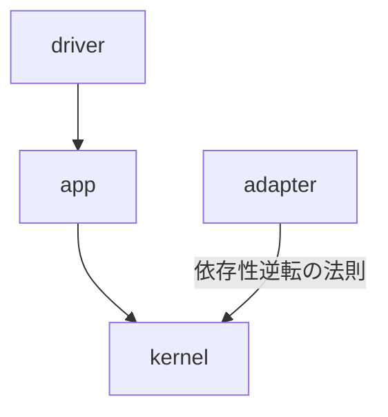

データベースに対して CRUD の操作をする Web API サーバをテストするときにテスト用のデータベースを用意するのは一般的だと思いますが、ローカルにデータベースをセットアップしたり Docker Compose でデータベースの Docker コンテナを立ち上げる手間があると思います。
そこで [Testcontainers](https://testcontainers.com/) を利用してテストコード内で Docker コンテナを立ち上げることで余計な手間を省く方法について紹介します。
また、本記事では Web API サーバを Rust で実装しレイヤードアーキテクチャを採用したので [Mockall](https://github.com/asomers/mockall) で各層のモックを作成する方法についても説明します。

今回追加したテストのコードは GitHub の Pull Request にまとめています。

https://github.com/pyama2000/example-cqrs-event-store/pull/13

# おさらい

本記事では [Rust で Event Sourcing を試してみた ~ AWS のブログを参考に模倣する ~](https://zenn.dev/pyama2000/articles/a0f612677b658b) で実装した Web API サーバをベースに説明するので用語やアーキテクチャ構成をおさらいします。

## 用語

- 集約: ドメイン駆動設計における一連の関連するエンティティをグループ化しドメインモデルの一貫性と整合性を保つためのオブジェクト
- コマンド: 集約の内部状態を外部からのリクエストやユーザーのアクションに応じて変更するためのオブジェクト
- イベント: 集約内で行われた操作 (コマンド) の結果としての状態変更結果を表現するオブジェクト

## アーキテクチャ構成

アプリケーションのアーキテクチャは `driver` / `app` / `kernel` / `adapter` の4層構造を採用していて、それぞれの層の役割は以下の通りです。

- `driver`: ルーターとサーバーの起動を担当する層
- `app`: ユースケースを実現するための層で集約へのコマンド実行を担当する
- `kernel`: ドメインを担当する層で集約やイベント、コマンドを定義する
- `adapter`: 集約やイベントの永続化を担当する層

各層の依存関係は以下のようになっており、上位のモジュールから下位のモジュールを呼び出すようにして、`kernel` と `adapter` は依存性逆転の原則 (DIP) により `adapter` の変更による影響範囲を最小限にしています。



それぞれの層は下位のモジュールから上位のモジュールを呼び出せないようにするために Rust の [workspace](https://doc.rust-lang.org/book/ch14-03-cargo-workspaces.html) で区切っています。

# 単体テスト

Testcontainers や Mockall を使ったテストを説明する前にテーブル駆動テストについて紹介します。
テーブル駆動テストとはテストケースのデータをテーブル形式で管理するテスト手法で、各テストケースは入力データと期待される結果のペアで構成されています。テストランナーはテーブル内の各テストケースを反復処理し、実際の結果を期待される結果と比較します。Rust ではテーブル駆動テストは一般的ではないと思いますが、テーブル形式でテストケースを管理することでテストケースの作成・編集・管理が容易になります。また、テストデータが構造化されているためテストの内容が明確になり、テストの可読性が向上すると思います。

下記のコードは `AggregateError` から `WidgetServiceError` に変換する処理のテストコードです。

https://github.com/pyama2000/example-cqrs-event-store/blob/fddee2cbefa26c9c73d5094b31cf23aac46d3786/internal/app/src/lib.rs#L210-L230

`TestCase` 構造体はテストケースを表現し、`error` フィールドは入力データを、`assert` フィールドは引数に変換後の値を `error` を受け取って期待する結果をテストします。

## Testcontainers を使ったテスト

実装したアプリケーションでは [SQLx](https://github.com/launchbadge/sqlx) でデータベース (MySQL) とやり取りしますが、 SQLx にはテスト実行時にテスト用のデータベースを作成したりマイグレーション・フィクスチャーを実行したりする [sqlx::test](https://docs.rs/sqlx/latest/sqlx/attr.test.html) という便利な Attribute Macro が用意されているので、こちらを利用するといいでしょう。しかし、ゆくゆくはデータベースを Amazon DynamoDB に変える予定なので極力 SQLx に依存しないテストを書くために今回は Testcontainers で Docker コンテナとして立ち上げたテスト用の MySQL に対してテストを実行します。

といっても下記のようにたった2行で Testcontainers で MySQL コンテナが立ち上がり、コンテナに接続するためのポートは [testcontainers::core::Container::get_host_port_ipv4](https://docs.rs/testcontainers/latest/testcontainers/core/struct.Container.html#method.get_host_port_ipv4) 関数で取得することができます。

https://github.com/pyama2000/example-cqrs-event-store/blob/fddee2cbefa26c9c73d5094b31cf23aac46d3786/internal/adapter/src/repository.rs#L262-L263

あとは MySQL に接続してマイグレーションを実行してテスト用のデータベースの準備は完了です。

https://github.com/pyama2000/example-cqrs-event-store/blob/fddee2cbefa26c9c73d5094b31cf23aac46d3786/internal/adapter/src/repository.rs#L264-L278

実際に集約の作成を永続化する関数 ( `create_widget_aggregate` ) を例に説明します。テスト対象の関数の実装は以下の通りです。

https://github.com/pyama2000/example-cqrs-event-store/blob/fddee2cbefa26c9c73d5094b31cf23aac46d3786/internal/adapter/src/repository.rs#L38-L59

この関数では集約に作成コマンドを実行した結果を Aggregate テーブルに永続化する関数なので、作成コマンド実行結果を引数に受け取った場合は

- 関数が成功する
- Aggregate テーブルに永続化される集約は1レコード
- レコードのそれぞれのカラムに意図した値が入っている

といったことをテストできたら良いでしょう。以下がテスト関数内で `TestCase` 構造体の定義とテストケースの定義、それをもとにテストを実行する処理です。

https://github.com/pyama2000/example-cqrs-event-store/blob/fddee2cbefa26c9c73d5094b31cf23aac46d3786/internal/adapter/src/repository.rs#L280-L338

`TestCase` 構造体の `assert` フィールド内でレコードのデータを取得するために SQLx を利用しますが、async クロージャーはまだ [安定版では利用できない](https://github.com/rust-lang/rust/issues/62290) ので

https://github.com/pyama2000/example-cqrs-event-store/blob/fddee2cbefa26c9c73d5094b31cf23aac46d3786/internal/adapter/src/repository.rs#L182-L186

のように `std::future::Future` を `std::boxed::Box` で包んで、さらに await を呼び出せるように `std::pin::Pin` で包んだものを返す関数を型として定義します。`assert` フィールドはテストケース名 ( `name` ) と `create_widget_aggregate` 関数の返り値 ( `result` ) 、SQLx で利用するコネクションプール ( `pool` ) を引数に取り、クロージャー内でそれらを利用して関数が意図した挙動を取るかテストします。

## Mockall を使ったテスト

Mockall は Trait や構造体の振る舞いをモックするための crate です。今回は `kernel` に定義したデータベースを操作する振る舞いを定義した `CommandProcessor` を例にモックの作成と利用方法について説明します。

https://github.com/pyama2000/example-cqrs-event-store/blob/fddee2cbefa26c9c73d5094b31cf23aac46d3786/internal/kernel/src/processor.rs#L7-L23

### モックの作成

`CommandProcessor` のモックをただ作成するなら

```rust:kernel/src/processor.rs
#[mockall::automock]
pub trait CommandProcessor {
    ...
}
```

のように [mockall::automock](https://docs.rs/mockall/latest/mockall/attr.automock.html) Attribute Macro を Trait に追加するだけで自動でモック用のコードを作成してくれます。しかし、このままコンパイルするとプロダクションコードにモックのコードが含まれてしまうためサイズが増えてしまいます。そこで、[cfg_attr](https://doc.rust-lang.org/reference/conditional-compilation.html#the-cfg_attr-attribute) Attribute を利用してテスト時のみモックを作るようにします。

```rust:kernel/src/processor.rs
#[cfg_attr(test, mockall::automock)]
pub trait CommandProcessor {
    ...
}
```

これで `kernel` crate の `CommandProcessor` のモックを `app` crate から呼び出せると思いきや、 [test](https://doc.rust-lang.org/reference/attributes/testing.html#the-test-attribute) Attribute は同一 crate 内でしか機能しないため今回のように workspace で区切っていた場合は別 crate からモックを呼び出すことができません。なので今回は [features の Optional Dependencies](https://doc.rust-lang.org/cargo/reference/features.html#optional-dependencies) で `app` crate からモックを呼び出せるようにします。

`kernel` crate の Cargo.toml を以下のように定義して

```toml:kernel/Cargo.toml
[dependencies]
mockall = { version = "0.12.1", optional = true }

[features]
mockall = ["dep:mockall"]
```

`CommandProcessor` は cfg_attr で `mockall` feature のときのみ `mockall::automock` をコンパイルするようにします。

```rust:kernel/src/processor.rs
#[cfg_attr(feature = "mockall", mockall::automock)]
pub trait CommandProcessor {
    ...
}
```

そして `app` crate の Cargo.toml は以下のように `dev-dependencies` で `mockall` feature を有効にして依存関係を追加することでテスト時のみモックを呼び出すことできます。

```toml:app/Cargo.toml
[dev-dependencies]
kernel = { path = "../kernel", features = ["mockall"] }
```

### モックを利用する

`mockall::automock` によって `CommandProcessor` に `MockCommandProcessor` が生成され、各関数に `expect_` プレフィックスが付いた関数を呼び出し、以下のように `returning` 関数で振る舞いをモックできます。

https://github.com/pyama2000/example-cqrs-event-store/blob/fddee2cbefa26c9c73d5094b31cf23aac46d3786/internal/app/src/lib.rs#L276-L279

他にも [with](https://docs.rs/mockall/latest/mockall/examples/__mock_MockFoo_Foo/__foo/struct.Expectation.html#method.with) や [withf](https://docs.rs/mockall/latest/mockall/examples/__mock_MockFoo_Foo/__foo/struct.Expectation.html#method.withf)、[withf_st](https://docs.rs/mockall/latest/mockall/examples/__mock_MockFoo_Foo/__foo/struct.Expectation.html#method.withf_st) の関数を利用してモックした関数の引数をテストできたり、

https://github.com/pyama2000/example-cqrs-event-store/blob/fddee2cbefa26c9c73d5094b31cf23aac46d3786/internal/app/src/lib.rs#L249-L263

[never](https://docs.rs/mockall/latest/mockall/examples/__mock_MockFoo_Foo/__foo/struct.Expectation.html#method.never) や [once](https://docs.rs/mockall/latest/mockall/examples/__mock_MockFoo_Foo/__foo/struct.Expectation.html#method.once)、[times](https://docs.rs/mockall/latest/mockall/examples/__mock_MockFoo_Foo/__foo/struct.Expectation.html#method.times) 関数で呼び出し回数をテストできたりするのでぜひ [User Guide](https://docs.rs/mockall/latest/mockall/index.html#user-guide) を参考にしてみてください。

https://github.com/pyama2000/example-cqrs-event-store/blob/fddee2cbefa26c9c73d5094b31cf23aac46d3786/internal/app/src/lib.rs#L344-L356

# 結合テスト

結合テストは立ち上げた API サーバに対してリクエストをして期待した挙動をテストするため、永続化の単体テストと同様 Testcontainers を利用します。
Testcontainers で MySQL のコンテナを立ち上げるのは同様のため割愛して API サーバを立ち上げる部分について説明したいと思います。

https://github.com/pyama2000/example-cqrs-event-store/blob/fddee2cbefa26c9c73d5094b31cf23aac46d3786/tests/integration_test.rs#L129-L138

上記のようにサーバーを別スレッドで立ち上げてヘルスチェックのエンドポイントである `/healthz` がレスポンスを返すまでループします。その後他の単体テスト同様 `TestCase` 構造体でテストケースを作成しテストを実行します。

今回は別スレッドで API サーバを立ち上げましたが、axum の [Router](https://docs.rs/axum/latest/axum/struct.Router.html) の `oneshot` 関数を利用して直接 Router にリクエストすることもできます。 ( [axum/examples/testing/src/main.rs](https://github.com/tokio-rs/axum/blob/b03f6c1184723bdc079215222fc168ef96847dea/examples/testing/src/main.rs#L68-L82) )

# まとめ

Testcontainers を利用してテストコード内で Docker コンテナを立ち上げてテストに利用する方法と、Mockall で各層のモックを作成してテストに利用する方法について説明しました。テストが有るのと無いのでは開発の進め方がかなり違うと思うのでどなたかの参考になればと思います。

次回は OpenTelemetry と OpenObserve を利用してアプリケーションを可視化してみたいと思います。
