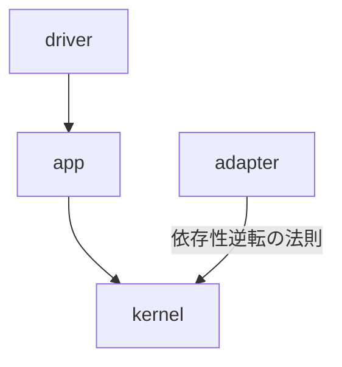
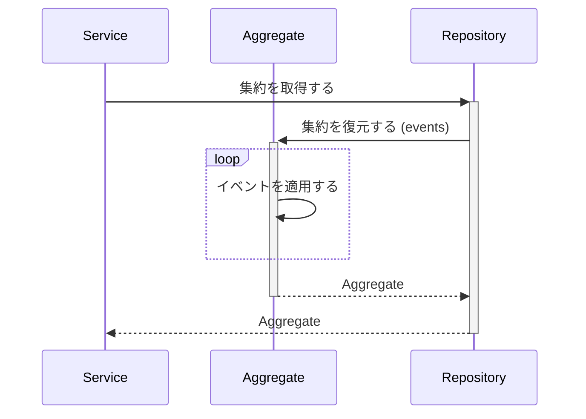
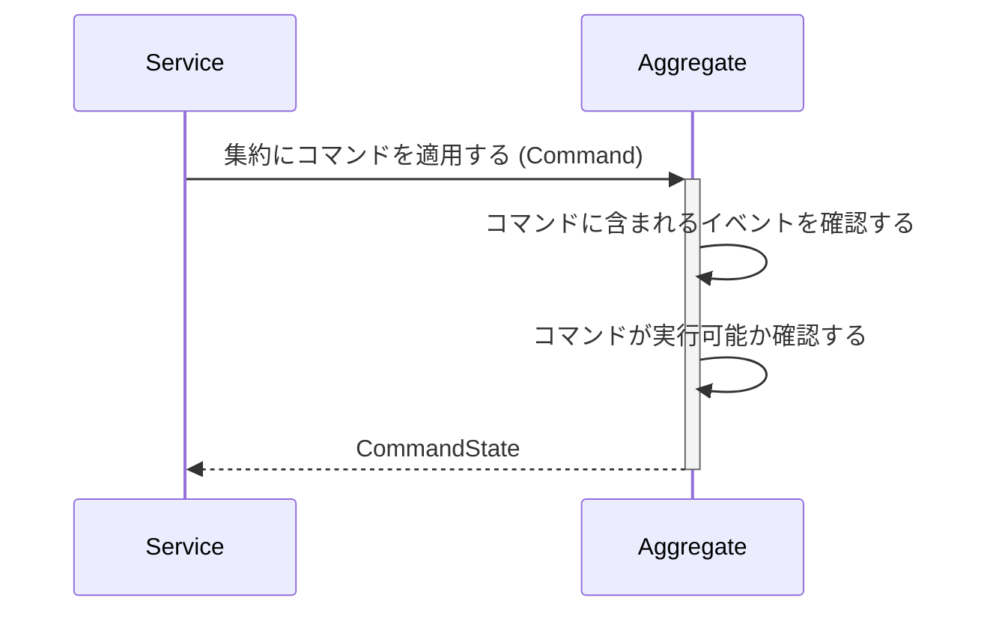
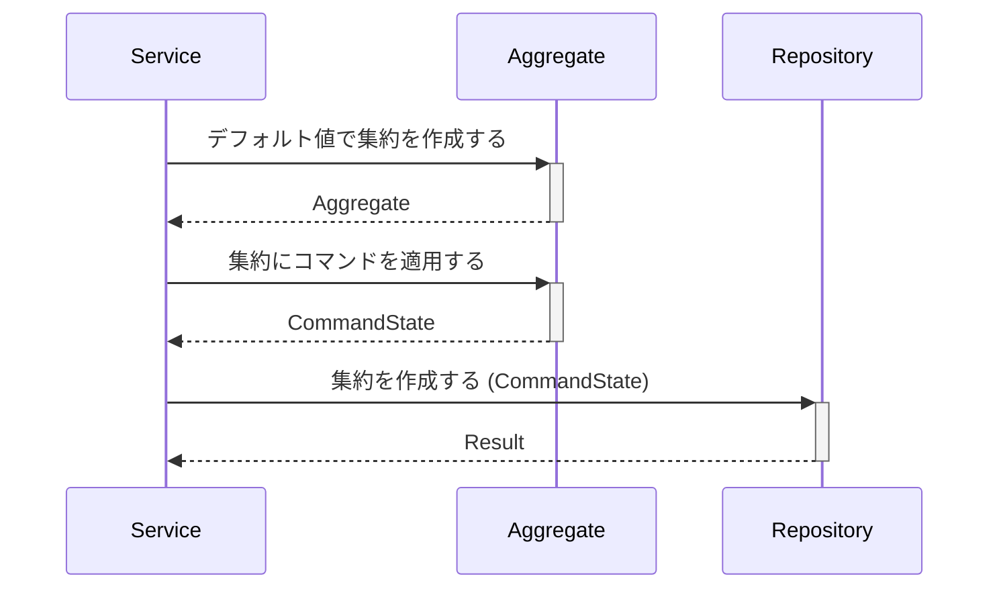
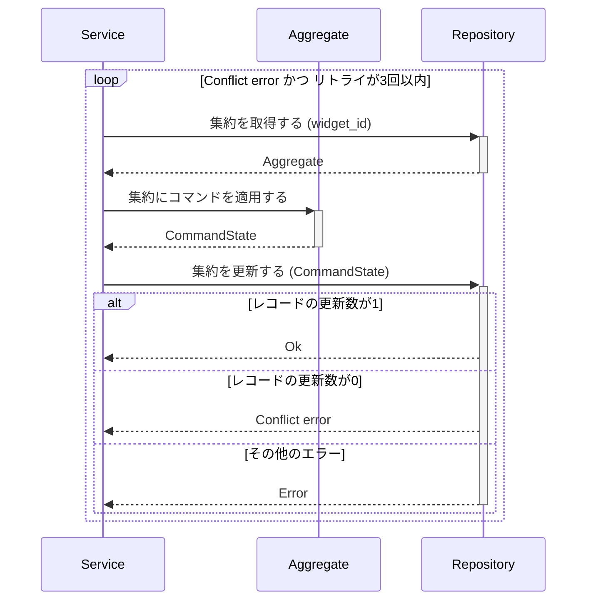
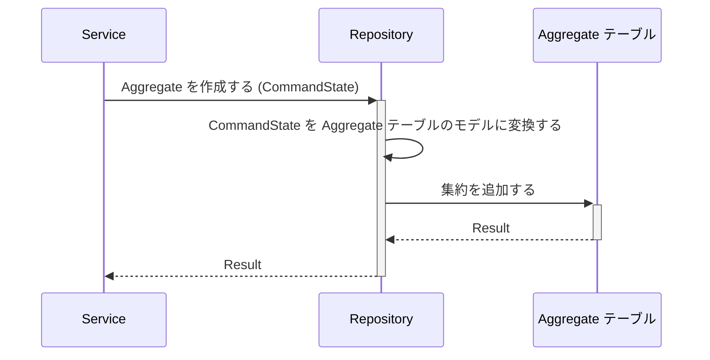
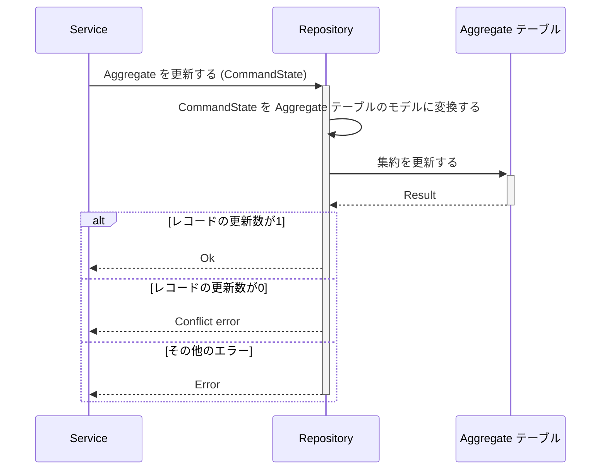
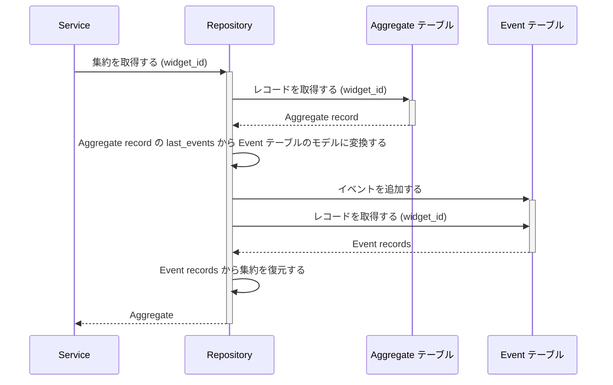

数年前に CQRS (コマンドクエリ責務分離) を知り、調べているときに AWS のブログで [Amazon DynamoDB を使った CQRS イベントストアの構築](https://aws.amazon.com/jp/blogs/news/build-a-cqrs-event-store-with-amazon-dynamodb/) を読む機会がありました。最初は記事を読み進めても処理の流れやコードのイメージが全く湧かなかったのですが数回読んで少し理解できたので、感覚を忘れないうちに実装してみました。なぜ Rust で実装したかというと久しぶりに Rust でアプリケーションを作りたかったからです。
また、 [Amazon DynamoDB を使った CQRS イベントストアの構築](https://aws.amazon.com/jp/blogs/news/build-a-cqrs-event-store-with-amazon-dynamodb/) ではデータストアに DynamoDB を使っていますが、私は DynamoDB を使ったことがないので MySQL を利用して実装しました。

アプリケーションのコードは GitHub で公開しています。

https://github.com/pyama2000/example-cqrs-event-store

# Event Sourcing について

Event Sourcing とはデータの操作をイベントとして表現し、イベントを唯一の信頼できるソースとする設計手法です。イベントは追加のみが許され、記録されたイベントを (信頼が損なわれるので) 変更することはできません。イベントを記録することでデータの操作履歴を保持できたりある時点のイベントまでロールバックしてデータを復元したりすることが容易です。またデータの更新が不要なのでロックする必要がないためパフォーマンスの低下を防ぐことができます。
Event Sourcing と従来の CRUD モデル (State Sourcing) の比較にネットショップのカートが例として取り上げられるのでこの記事でも比較の例とします。

## ユーザーの操作を State Sourcing と Event Sourcing で比較する

ユーザー (pyama2000) の操作は以下を想定しています。

1. 商品 A を1つカートに追加する
2. 商品 B を2つカートに追加する
3. 商品 C を3つカートに追加する
4. 商品 A の注文数を5つに増やす
5. 商品 C をカートから削除する

### State Sourcing の場合

CRUD による State Sourcing ではユーザーの操作をデータの作成・更新・削除することでカートの状態を表現します。

1. 商品 A を1つカートに追加する

   | USER ID   | ITEM ID | NUM |
   | --------- | ------- | --- |
   | pyama2000 | A       | 1   |

2. 商品 B を1つカートに追加する

   | USER ID   | ITEM ID | NUM |
   | --------- | ------- | --- |
   | pyama2000 | A       | 1   |
   | pyama2000 | B       | 2   |

3. 商品 C を1つカートに追加する

   | USER ID   | ITEM ID | NUM |
   | --------- | ------- | --- |
   | pyama2000 | A       | 1   |
   | pyama2000 | B       | 1   |
   | pyama2000 | C       | 3   |

4. 商品 A の注文数を5つに増やす

   | USER ID   | ITEM ID | NUM |
   | --------- | ------- | --- |
   | pyama2000 | A       | 5   |
   | pyama2000 | B       | 2   |
   | pyama2000 | C       | 3   |

5. 商品 C をカートから削除する

   | USER ID   | ITEM ID | NUM |
   | --------- | ------- | --- |
   | pyama2000 | A       | 5   |
   | pyama2000 | B       | 2   |

もちろん State Sourcing でも問題なくカートの状態を表現できますが最終的なカートの中身しか記録されません。こうなるとユーザーの操作が不明なので万が一「カートに入れた覚えのない商品が届いた！😡」というクレームに対して膨大なアクセスログを確認する羽目になります。

## Event Sourcing の場合

一方で、Event Sourcing ではユーザーの操作を一連のイベントとして記録することでカートの状態を表現します。

1. 商品 A を1つカートに追加する

   | EVENT ID | USER ID   | ITEM ID | EVENT NAME         |
   | -------- | --------- | ------- | ------------------ |
   | 1        | pyama2000 | A       | ItemAdded (NUM: 1) |

2. 商品 B を1つカートに追加する

   | EVENT ID | USER ID   | ITEM ID | EVENT NAME         |
   | -------- | --------- | ------- | ------------------ |
   | 1        | pyama2000 | A       | ItemAdded (NUM: 1) |
   | 2        | pyama2000 | B       | ItemAdded (NUM: 2) |

3. 商品 C を1つカートに追加する

   | EVENT ID | USER ID   | ITEM ID | EVENT NAME         |
   | -------- | --------- | ------- | ------------------ |
   | 1        | pyama2000 | A       | ItemAdded (NUM: 1) |
   | 2        | pyama2000 | B       | ItemAdded (NUM: 2) |
   | 3        | pyama2000 | C       | ItemAdded (NUM: 3) |

4. 商品 A の注文数を5つに増やす

   | EVENT ID | USER ID   | ITEM ID | EVENT NAME              |
   | -------- | --------- | ------- | ----------------------- |
   | 1        | pyama2000 | A       | ItemAdded (NUM: 1)      |
   | 2        | pyama2000 | B       | ItemAdded (NUM: 2)      |
   | 3        | pyama2000 | C       | ItemAdded (NUM: 3)      |
   | 4        | pyama2000 | A       | ItemNumChanged (NUM: 5) |

5. 商品 C をカートから削除する

   | EVENT ID | USER ID   | ITEM ID | EVENT NAME              |
   | -------- | --------- | ------- | ----------------------- |
   | 1        | pyama2000 | A       | ItemAdded (NUM: 1)      |
   | 2        | pyama2000 | B       | ItemAdded (NUM: 2)      |
   | 3        | pyama2000 | C       | ItemAdded (NUM: 3)      |
   | 4        | pyama2000 | A       | ItemNumChanged (NUM: 5) |
   | 5        | pyama2000 | C       | ItemDeleted             |

このようにユーザーが操作したイベントを記録し、一連のイベントからカートの状態を表現することができます。ユーザーの操作をイベントとして記録しているのでクレームへの対応に対しても説明がしやすいですし、バグだった場合は再現手順も容易です。

クレームへの対応の例を挙げましたが、記録されたイベントの一連は監査ログやマイクロサービス間のトランザクション処理などにも有用だと考えられます。一方で Event Sourcing ではデータをロックしないため結果整合性を受け入れる必要があり、実装が複雑になるといった側面もあります。

参考までに [Amazon DynamoDB を使った CQRS イベントストアの構築](https://aws.amazon.com/jp/blogs/news/build-a-cqrs-event-store-with-amazon-dynamodb/) では (CQRS +) Event Sourcing のユースケースに以下が挙げられていたのでプロダクトに組み込む際の一助となればと思います。

> - リッチなドメインモデルをサポートしており、モデルが複雑なビジネスロジックやルールを内包している
> - マイクロサービス間やシステム境界を跨いでイベントを伝播させる必要がある
> - イベントストーミングのようなイベント起点のアプローチを使って設計されている

# 実装について

[Amazon DynamoDB を使った CQRS イベントストアの構築](https://aws.amazon.com/jp/blogs/news/build-a-cqrs-event-store-with-amazon-dynamodb/) に合わせて部品 (Widget) を操作するアプリケーションを実装したので、こちらの記事も一緒に読むと実装の理解が深まると思います。

本記事で説明するコードは PR にまとめています。

https://github.com/pyama2000/example-cqrs-event-store/pull/7

## アーキテクチャ構成

アプリケーションのアーキテクチャは [Rust の新しい HTTP サーバーのクレート Axum をフルに活用してサーバーサイドアプリケーション開発をしてみる](https://blog-dry.com/entry/2021/12/26/002649) を参考に `driver` / `app` / `kernel` / `adapter` の4層構造となっています。
それぞれの層の役割は以下の通りです。

- `driver`: ルーターとサーバーの起動を担当する層
- `app`: ユースケースを実現するための層で集約へのコマンド実行を担当する
- `kernel`: ドメインを担当する層で集約やイベント、コマンドを定義する
- `adapter`: 集約やイベントの永続化を担当する層

各層の依存関係は以下のようになっており、上位のモジュールから下位のモジュールを呼び出すようにして、`kernel` と `adapter` は依存性逆転の原則 (DIP) により `adapter` の変更による影響範囲を最小限にしています。



それぞれの層は下位のモジュールから上位のモジュールを呼び出せないようにするほかに、コンパイル速度を向上させるために Rust の [workspace](https://doc.rust-lang.org/book/ch14-03-cargo-workspaces.html) で区切っています。

## コードを読み進める上で

`std::str::FromStr` や `TryFrom` / `TryInto` を含め全ての Result::Err の型は `Box<dyn std::error::Error + Send + Sync + 'static>` にしていますが、都度記述するのは大変なので `lib` クレートで Error と Result の型を定義しています。

https://github.com/pyama2000/example-cqrs-event-store/blob/5644e19eb328e8dc4e82a2489dc475af0d084ba2/internal/lib/src/lib.rs#L1-L2

また、`Id<T>` 構造体を定義して集約やイベントの ID として使っています。

https://github.com/pyama2000/example-cqrs-event-store/blob/5644e19eb328e8dc4e82a2489dc475af0d084ba2/internal/kernel/src/lib.rs#L15-L18

## kernel

`kernel` で集約やイベント、コマンドを定義します。

集約はドメインロジックを定義するほかにコマンドを処理する役割を持ちます。コマンドとはシステムを変更する操作を表していて、1つ以上のイベントから構成されます。例えば部品 (Widget) を作成する `CreateWidget` コマンドを実行すると `WidgetCreated` というイベントが発生するといった具合です。イベントはこれまで説明してきたようにデータの操作を表しています。

### イベント

`WidgetEvent` はデータ操作のイベントを表現する列挙体です。

https://github.com/pyama2000/example-cqrs-event-store/blob/5644e19eb328e8dc4e82a2489dc475af0d084ba2/internal/kernel/src/event.rs#L5-L29

`WidgetEvent` には

- `WidgetCreated`: 部品を作成するイベント
- `WidgetNameChanged`: 部品の名前を変更するイベント
- `WidgetDescriptionChanged`: 部品の説明を変更するイベント

が定義され、それぞれのイベントにはイベント自身の ID ( `id` ) とイベントによって部品の要素 (名前や説明) をどう変化させるかの値を持っています。

### コマンド

`WidgetCommand` は部品に対してどのような操作をするかを表します。

https://github.com/pyama2000/example-cqrs-event-store/blob/5644e19eb328e8dc4e82a2489dc475af0d084ba2/internal/kernel/src/command.rs#L6-L13

`WidgetCommand` には

- `CreateWidget`: 部品を作成するコマンド
- `ChangeWidgetName`: 部品の名前を変更するコマンド
- `ChangeWidgetDescription`: 部品の説明を変更するコマンド

が定義され、それぞれ1つのイベント ( `WidgetEvent` ) から構成されます。1コマンドで複数のイベントが発生する場合は下記のように定義します。

```diff rust
pub enum WidgetCommand {
    /// 部品を新しく作成する
    CreateWidget(WidgetEvent),
    /// 部品の名前を変更する
    ChangeWidgetName(WidgetEvent),
    /// 部品の説明を変更する
    ChangeWidgetDescription(WidgetEvent),
    /// 複数のイベントが発生するコマンド
+   DoSomething(Vec<WidgetEvent>),
}
```

### 集約

実装したアプリケーションでは集約を `WidgetAggregate` という構造体で表現しました。

https://github.com/pyama2000/example-cqrs-event-store/blob/5644e19eb328e8dc4e82a2489dc475af0d084ba2/internal/kernel/src/aggregate.rs#L10-L15

`WidgetAggregate` は集約自身の ID ( `id` ) と部品の名前 ( `name` )、部品の説明 ( `description` ) 、そして集約の更新回数を表す `version` をフィールドに持っています。`version` フィールドは同時接続などによって競合状態を避けるために使われます。また、不用意に変更されないようフィールドを非公開状態にして関数で値を取得するようにしています。

#### イベントから集約の状態を復元する



[Amazon DynamoDB を使った CQRS イベントストアの構築](https://aws.amazon.com/jp/blogs/news/build-a-cqrs-event-store-with-amazon-dynamodb/) の「集約読み込みのアルゴリズム」ではイベントの永続化の言及がありますがその話は後ほど説明するとして、ここでは `adapter` でテーブルから取得したイベントのリストから集約を復元する説明をします。

と言ってもイベントから集約の状態を復元する役割をもつ `WidgetAggregateState` 構造体は集約 ( `aggregate` ) とイベントのリスト ( `events` ) 、集約の ID ( `widget_id` ) 、集約の更新回数 ( `aggregate_version` ) で初期化された後に `restore` 関数を呼び出して `aggregate` の値を `events` を適用して変更した結果の集約を返すだけです。

https://github.com/pyama2000/example-cqrs-event-store/blob/5644e19eb328e8dc4e82a2489dc475af0d084ba2/internal/kernel/src/aggregate.rs#L206-L258

#### 集約にコマンドを適用する



集約の `apply_command` 関数は引数に受け取ったコマンドを適用しますが、その際に変更される値のバリデーションチェックやビジネスロジックの確認をします。

https://github.com/pyama2000/example-cqrs-event-store/blob/5644e19eb328e8dc4e82a2489dc475af0d084ba2/internal/kernel/src/aggregate.rs#L39-L43

処理全てを `apply_command` 関数内に記述してもいいですが今回は [RustのちょっとやりすぎなBuilderパターン](https://keens.github.io/blog/2017/02/09/rustnochottoyarisuginabuilderpata_n/) を参考に構造体に Generics を定義して、まずコマンドに含まれるイベントの正当性を確認してから順不同で部品名や説明の値をバリデーションチェックするようにしています。

https://github.com/pyama2000/example-cqrs-event-store/blob/5644e19eb328e8dc4e82a2489dc475af0d084ba2/internal/kernel/src/aggregate.rs#L73-L204

### Repository のインターフェイス

Repository のインターフェイスは 集約の作成/集約の復元/集約の更新 の3つのみです。

https://github.com/pyama2000/example-cqrs-event-store/blob/5644e19eb328e8dc4e82a2489dc475af0d084ba2/internal/kernel/src/processor.rs#L7-L23

## app

`app` はユースケースの定義を担う層で、ユースケースは集約とコマンドによって表現されます。

部品の作成時には集約は当然テーブルに無いためデフォルト値で初期化した `WidgetAggregate` に部品を作成するコマンド ( `WidgetCommand::CreateWidget` ) を適用します。



https://github.com/pyama2000/example-cqrs-event-store/blob/5644e19eb328e8dc4e82a2489dc475af0d084ba2/internal/app/src/lib.rs#L75-L88

部品の名前や説明の変更時は復元された集約に対してコマンドを実行して集約を更新します。`change_widget_name` / `change_widget_description` 関数は同時接続によって他のユーザーが集約を更新していた場合に最大3回、集約の復元からやり直して集約の更新を試みるように実装しました。



https://github.com/pyama2000/example-cqrs-event-store/blob/5644e19eb328e8dc4e82a2489dc475af0d084ba2/internal/app/src/lib.rs#L90-L145

## adapter

`adapter` では集約とイベントを永続化します。

### テーブルの定義

集約とイベントのテーブルは以下のように定義します。

集約 ( `Aggregate` ) テーブル:

https://github.com/pyama2000/example-cqrs-event-store/blob/5644e19eb328e8dc4e82a2489dc475af0d084ba2/migrations/20240210132634_create_aggregate.sql

イベント ( `Event` ) テーブル:

https://github.com/pyama2000/example-cqrs-event-store/blob/5644e19eb328e8dc4e82a2489dc475af0d084ba2/migrations/20240210132646_create_event.sql

Aggregate テーブルのレコードは集約の ID ( `widget_id` ) と更新回数 ( `aggregate_version` )、そして集約に発生したイベントのリスト ( `last_events` ) で保持します。`last_events` は JSON 形式で表され、例えば部品を作成するイベントが発生した時は

```json
[{
  "event_id": "イベントの ID",
  "event_name": "WidgetCreated"
  "payload": {
    "version": "V1",
    "widget_name": "WidgetName1"
    "widget_description": "WidgetDescription1"
  }
}]
```

のようなデータが保存されます。`payload` は集約の値をイベントでどう変更するかの情報を持っていて、`payload.version` でバージョニングすることで将来的にイベントが変更されても互換性のあるようにしています。

Event テーブルのレコードは Aggregate テーブルの `last_events` を展開したようなデータが保存されますが、1レコード1イベントとして記録します。

### 集約を作成する処理



集約を作成する処理 ( `create_widget_aggregate` 関数) は至ってシンプルで、引数で受け取った `CommandState` をそのまま Aggregate テーブルに保存します。

https://github.com/pyama2000/example-cqrs-event-store/blob/5644e19eb328e8dc4e82a2489dc475af0d084ba2/internal/adapter/src/repository.rs#L21-L37

### 集約を更新する処理



集約を更新する処理 ( `update_widget_aggregate` 関数) も集約を作成する処理と似たように引数で受け取った `CommandState` をそのまま Aggregate テーブルに保存します。

https://github.com/pyama2000/example-cqrs-event-store/blob/5644e19eb328e8dc4e82a2489dc475af0d084ba2/internal/adapter/src/repository.rs#L110-L138

集約を作成する処理と違う点は、同時接続によって Aggregate テーブルに保存する集約が競合しないように UPDATE 文の WHERE 句で1つ前の `aggregate_version` を指定していることです。これは楽観ロックと呼ばれる排他制御の手法で、別のユーザーによって既に集約が更新されていた場合は更新対象のレコードが見つからないため更新を防ぐことができます。

### 集約をイベントから復元する処理

:::message
ここの処理が一番理解するのに時間がかかった部分だったので [Amazon DynamoDB を使った CQRS イベントストアの構築](https://aws.amazon.com/jp/blogs/news/build-a-cqrs-event-store-with-amazon-dynamodb/) の「集約読み込みのアルゴリズム」を先に読むことをおすすめします
:::



集約をイベントから復元する処理 ( `get_widget_aggregate` 関数) は以下手順で集約を復元します。

1. Aggregate テーブルから集約の ID でデータを取得する
2. 取得した Aggregate テーブルのレコードデータの `last_events` にあるイベントのリストを Event テーブルに保存する
3. Event テーブルから集約の ID で全てのイベントを取得する
4. 取得した Aggregate テーブルと Event テーブルのレコードデータから集約を復元する

注目すべきは「2. 取得した Aggregate テーブルのレコードデータの `last_events` にあるイベントのリストを Event テーブルに保存する」の部分ですが、集約の作成や更新の処理でイベントを永続化するのではなく復元する段階で Event テーブルに永続化します。正直なところ未だに納得できていませんが、同時接続によって Event テーブルに永続化されるイベントの順番を保証したり、イベントの永続化を復元処理の1関数に留めることを目的としているのだと思います。(知っている方がいればコメントで教えてください)

https://github.com/pyama2000/example-cqrs-event-store/blob/5644e19eb328e8dc4e82a2489dc475af0d084ba2/internal/adapter/src/repository.rs#L39-L108

# アプリケーションの使い方

実装したアプリケーションは GitHub で公開しているのでローカルにクローンして README または下記手順に従ってアプリケーションを試すことができます。

https://github.com/pyama2000/example-cqrs-event-store

## アプリケーションの起動方法

アプリケーションの動作は下記環境で確認しています。

- Rust: 1.76.0
- MySQL: 8.1

[Amazon DynamoDB を使った CQRS イベントストアの構築](https://aws.amazon.com/jp/blogs/news/build-a-cqrs-event-store-with-amazon-dynamodb/) では DynamoDB を使ってイベントストアを実装していますが、この記事では MySQL を利用します。
MySQL は Docker Compose でコンテナとして立ち上げるようにしていて、下記環境変数によって設定を変更できます。

| 環境変数       | 説明                           | デフォルト値 |
| -------------- | ------------------------------ | ------------ |
| MYSQL_PORT     | ホスト側に公開するポート       | `3306`       |
| MYSQL_USERNAME | MySQL に接続するユーザー名     | `root`       |
| MYSQL_PASSWORD | MySQL に接続するパスワード     | `root`       |
| MYSQL_DATABASE | MySQL に接続するデータベース名 | `widget`     |

MySQL コンテナの立ち上げからマイグレーションの実行、アプリケーションの起動は以下のコマンドを実行します。

```shell
# Docker Compose で MySQL コンテナを立ち上げる
docker compose up --wait
# データベースにマイグレーションを実行する
cargo run --bin migrate --features migrate
# アプリケーションを起動する
cargo run --release
# (optional) mysql コマンドでデータベースに接続する
mysql \
  -h 127.0.0.1 \
  --port "${MYSQL_PORT:-3306}" \
  --user "${MYSQL_USERNAME:-root}" \
  -p"${MYSQL_PASSWORD:-root}" \
  --database "${MYSQL_DATABASE:-widget}"
```

## Widget の操作をする

以下の手順に従って WIdget の操作をします。
また、今回は Widget のデータを取得するエンドポイントを作っていないので MySQL クライアントで DB に接続して Aggregate テーブルと Event テーブルを見ながらリクエストすることをおすすめします。

- Widget を作成する
  - エンドポイント: `/widgets`
  - メソッド: `POST`
  - ヘッダー: `Content-Type: application/json`
  - リクエストボディ:
    ```json
    {
      "widget_name": "Widget の名前",
      "widget_description": "Widget の説明"
    }
    ```
  - レスポンスボディ:
    ```json
    {
      "widget_id": "Widget の識別子 (ULID)"
    }
    ```
- Widget の名前を変更する
  - エンドポイント: `/widgets/${WIDGET_ID}/name`
  - メソッド: `POST`
  - ヘッダー: `Content-Type: application/json`
  - リクエストボディ:
    ```json
    {
      "widget_name": "変更後の Widget の名前"
    }
    ```
- Widget の説明を変更する
  - エンドポイント: `/widgets/${WIDGET_ID}/description`
  - メソッド: `POST`
  - ヘッダー: `Content-Type: application/json`
  - リクエストボディ:
    ```json
    {
      "widget_description": "変更後の Widget の説明"
    }
    ```

curl の例:

```shell
# Widget を作成する
WIDGET_ID=$(
  curl -s http://localhost:8080/widgets \
    -H "Content-Type: application/json" \
    -d '
       {
         "widget_name": "widget name v1",
         "widget_description": "widget description v1"
       }' \
    | jq -r '.widget_id'
)
# Widget の名前を変更する
curl -v "http://localhost:8080/widgets/${WIDGET_ID}/name" \
  -H "Content-Type: application/json" \
  -d '{ "widget_name": "widget name v2"}'
# Widget の説明を変更する
curl -v "http://localhost:8080/widgets/${WIDGET_ID}/description" \
  -H "Content-Type: application/json" \
  -d '{ "widget_description": "widget description v2"}'
```

# まとめ

[Amazon DynamoDB を使った CQRS イベントストアの構築](https://aws.amazon.com/jp/blogs/news/build-a-cqrs-event-store-with-amazon-dynamodb/) を参考に Rust で Event Sourcing を試してみました。実装前はデータの状態を一連のイベントで表現するのは複雑な実装になりそうだな、と思っていましたがいざ実装してみるとトランザクション処理から開放されたり Repository のインターフェイスが少なかったりと意外にもシンプルな実装になりました。イベントでユーザーの操作を記録できるので、イベントを起点に別アプリケーションで処理を実行するなどアプリケーション同士が疎になって運用もしやすいのだろうと思います。さらにイベントをログ代わりにできるのも魅力の1つだと感じました。

次回はテスト編でお会いいたしましょう。
